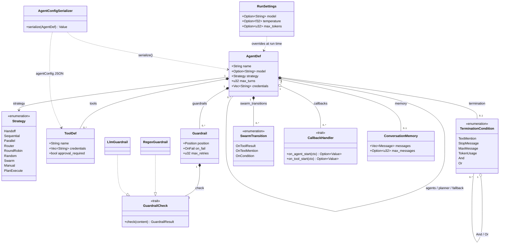
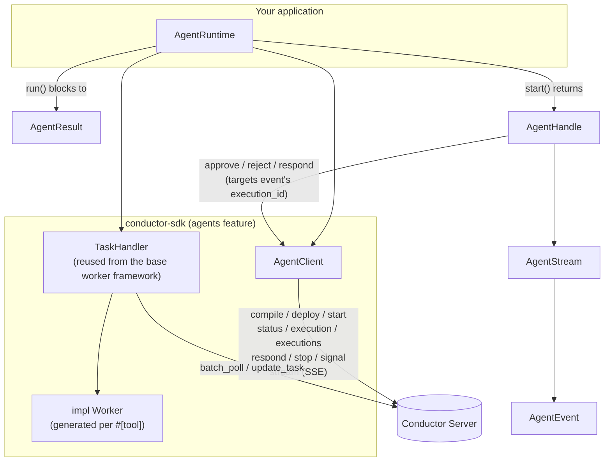

# Rust Agents Parity Plan

## Classes

### Definition (serialized to agentConfig)

- `AgentDef` — name, model, instructions, tools, sub-agents, strategy, guardrails, termination, memory, credentials, plus run tuning (`max_turns` default 25, `max_tokens`, `timeout_seconds`, `temperature`, `reasoning_effort`), routing (`router`, required when `strategy = Router`), output typing (`output_type`), swarm/handoff wiring (`swarm_transitions`, `allowed_transitions`), and `PlanExecute`-only fields (`planner`, `fallback`, `fallback_max_turns`, `planner_context`, `synthesize`)
- `RunSettings` — per-run override (model / temperature / max_tokens / reasoning_effort / thinking_budget_tokens); doesn't mutate the base `AgentDef`
- `ToolDef`, `Guardrail` (`RegexGuardrail`, `LlmGuardrail`), `TerminationCondition`, `SwarmTransition`, `CallbackHandler`, `ConversationMemory`



Filled circle (`*--`) = owns and serializes (part of `agentConfig`); open circle (`o--`) = holds a
reference but doesn't necessarily own the wire representation the same way (e.g. `CallbackHandler`
is a trait object registered by the caller, not data `AgentDef` constructs). `RunSettings` and
`AgentConfigSerializer` are dependencies on `AgentDef`, not part of it — `RunSettings` never gets
stored on an `AgentDef`, and the serializer is a free function/impl over it, not a field.

### Runtime + Transport

- `AgentClient` — thin transport over `/agent/*` (compile / deploy / start / status / execution / executions / respond / stop / signal / stream), same shape as `SecretClient`/`PromptClient`
- `AgentRuntime` — compiles `AgentDef` → `agentConfig`, owns a `TaskHandler` for local tool workers, drives lifecycle: `plan` / `deploy` / `serve` / `run` / `start` / `resume`
- `AgentHandle`, `AgentResult`, `AgentStatus`, `AgentEvent`, `AgentStream` — result, streaming, and HITL types



The load-bearing detail this diagram is meant to make obvious at a glance: `AgentRuntime` does
**not** run its own polling loop — it composes the same `TaskHandler` every other worker in this
SDK uses, and `AgentClient` is purely the `/agent/*` control-plane transport, with no polling of
its own. Everything under "SDK" talks to one Conductor server; there's no second backend.

## Examples

### 1. Tools

```rust
use conductor::agents::{tool, AgentDef, AgentRuntime};
use conductor::{Configuration, error::Result};
use schemars::JsonSchema;
use serde::Deserialize;
use serde_json::{json, Value};

#[derive(JsonSchema, Deserialize)]
struct GetWeatherArgs {
    city: String,
    #[serde(default = "default_units")]
    units: String,
}
fn default_units() -> String { "metric".into() }

#[tool(description = "Get current weather for a city")]
async fn get_weather(args: GetWeatherArgs) -> Result<Value> {
    Ok(json!({ "temp_c": 21.0, "summary": format!("Sunny in {}", args.city) }))
}

#[tokio::main]
async fn main() -> Result<()> {
    let mut runtime = AgentRuntime::new(Configuration::from_env())?;
    let agent = AgentDef::new("weather")?
        .with_model("openai/gpt-4o")
        .with_instructions("Answer weather questions.")
        .with_tool(get_weather_tool());

    let result = runtime.run(&agent, json!({ "prompt": "Weather in Lisbon?" })).await?;
    println!("{}", result.output);
    runtime.shutdown().await
}
```

`#[tool]` marks a function as a tool. Types/required-vs-optional come from the args struct's own
fields (`Option<T>` / `#[serde(default)]`), not from scanning keyword defaults at runtime the way
a dynamically-typed SDK would — one struct = one JSON object, matching how OpenAI/Anthropic tool
calls are actually shaped. Description is the attribute string; there's no "humanize the function
name" fallback, since an LLM-facing description left to a naming convention is exactly the kind of
implicit contract the credentials design below avoids too.

### 2. Streaming + approval

```rust
#[tool(description = "Issue a refund", approval_required = true)]
async fn issue_refund(args: RefundArgs) -> Result<Value> {
    billing::refund(&args.order_id, args.amount).await
}

let agent = AgentDef::new("support")?
    .with_model("anthropic/claude-sonnet-4-5")
    .with_instructions("Help with orders.")
    .with_tool(issue_refund_tool());

let input = json!({ "prompt": "Refund order A-1029, it arrived broken" });

// blocking
let result = runtime.run(&agent, input.clone()).await?;

// non-blocking, callback when finished
let handle = runtime.start(&agent, input.clone()).await?;
tokio::spawn(async move {
    if let Ok(result) = handle.join().await {
        mailer::send(&customer, &result.output).await;
    }
});

// non-blocking, poll/stream it yourself — approval decision lives at the call site
let handle = runtime.start(&agent, input).await?;
let mut stream = handle.stream().await?;
while let Some(event) = stream.next().await.transpose()? {
    match event {
        AgentEvent::Waiting { execution_id, pending_tool }
            if pending_tool["tool_name"] == "issue_refund" =>
        {
            if pending_tool["parameters"]["amount"].as_f64().unwrap_or(0.0) < 100.0 {
                handle.approve(&execution_id).await?;
            } else {
                handle.reject(&execution_id, "Needs a manager").await?;
            }
        }
        AgentEvent::Done { output, .. } => println!("{output}"),
        _ => {}
    }
}
```

No `on_approval` block registered on the agent up front — the decision is made at the call site
against the `Waiting` event. `execution_id` is mandatory on every `AgentEvent` variant, not
optional, because `Handoff`/`Sequential`/`Parallel` strategies put a pending `HUMAN` step in a
nested sub-execution — `approve`/`reject`/`respond` must target that inner id, not the top-level
handle's, and there's no code path that compiles without one in hand. "Non-blocking with a
callback when done" needs no bespoke API — it's just `tokio::spawn` wrapping `handle.join()`,
since Rust already has a general answer to "run this in the background and do something when it
finishes."

### 3. Team + secret

```rust
#[tool(description = "File a GitHub issue", credentials = ["GH_TOKEN"])]
async fn create_issue(args: CreateIssueArgs, creds: &Credentials) -> Result<Value> {
    github::create_issue(&args.title, &args.body, creds.get("GH_TOKEN")?).await
}

let triage = AgentDef::new("triage")?
    .with_model("openai/gpt-4o-mini")
    .with_instructions("Read the bug report. Say ACTIONABLE if it should be filed.");

let filer = AgentDef::new("filer")?
    .with_model("anthropic/claude-sonnet-4-5")
    .with_instructions("File the bug as a GitHub issue.")
    .with_tool(create_issue_tool());

let team = AgentDef::new("bug_desk")?
    .with_strategy(Strategy::Swarm)
    .with_sub_agent(triage)
    .with_sub_agent(filer)
    .with_swarm_transition(SwarmTransition::OnTextMention {
        text: "ACTIONABLE".into(),
        target: "filer".into(),
    });

let result = runtime.run(&team, json!({ "prompt": std::fs::read_to_string("report.md")? })).await?;
println!("{}", result.output);
```

`Strategy::Swarm` + `SwarmTransition::OnTextMention` is the rule-based transfer this example
actually wants ("hand off exactly when triage says ACTIONABLE") — the default `Strategy::Handoff`
would let the model free-form decide instead, which is a different, looser guarantee. Naming this
`SwarmTransition` rather than `HandoffCondition` (python's name) is deliberate: python has both a
`Strategy::HANDOFF` (model-driven) and a `HandoffCondition` (swarm-only, rule-driven) sharing the
word "handoff," which is a real confusion in python's own codebase that this port disambiguates
instead of reproducing.

## Secrets

| Secret | Held by | You write |
| --- | --- | --- |
| Conductor auth | your env | `CONDUCTOR_AUTH_KEY`, `CONDUCTOR_AUTH_SECRET` — existing `Configuration`, unchanged |
| LLM provider key | server Integration | `model: "openai/gpt-4o"` — `openai` is the integration name. SDK never sees the key. |
| Tool credential | server secret store | `#[tool(credentials = ["GH_TOKEN"])]` declares it; `creds.get("GH_TOKEN")` in the tool body reads it |

Credentials never flow through env vars, `.env` files, or an OS keyring inside the SDK — the
Conductor server is the only source of truth. A tool/agent declares credential *names* (never
values); those names get stamped onto `TaskDef.runtimeMetadata` at registration; the server
resolves them against its own secret store; resolved values are attached to `Task.runtimeMetadata`
on the specific `Task` handed to that poll — never persisted to task input, never a separate fetch
call. Reading a declared name that isn't present in `task.runtime_metadata` fails closed
(`ConductorError::CredentialNotFound`) — never a silent fallback to the process environment.

### Flow: tool credential

#### Use a secret in a tool

```rust
#[tool(description = "File a GitHub issue", credentials = ["GH_TOKEN"])]
async fn create_issue(args: CreateIssueArgs, creds: &Credentials) -> Result<Value> {
    github::create_issue(&args.title, &args.body, creds.get("GH_TOKEN")?).await
}
```

Two touch points instead of one: the `credentials = [...]` attribute is the declaration (it's what
gets stamped onto `TaskDef.runtimeMetadata`), `creds.get(...)` is the read. This is chosen on
purpose over collapsing both into a single `secret("GH_TOKEN")`-style call: the credential
contract stays visible in the tool's signature without reading the body, and there's no
silent-miss case for a name built from a non-literal expression. Worth revisiting if the two-line
form proves annoying in practice — it's a cheap alternative, not a hard architectural wall.

#### When the name isn't a literal

```rust
agent.with_tool_credentials("create_issue", vec!["GH_TOKEN".into()]);  // this tool
let agent = AgentDef::new("filer")?.with_credentials(vec!["GH_TOKEN".into()]);  // everything under this agent
```

#### Tool that shells out

```rust
#[tool(description = "File a GitHub issue via gh CLI", credentials = ["GH_TOKEN"])]
async fn gh_create_issue(args: CreateIssueArgs, creds: &Credentials) -> Result<Value> {
    let output = tokio::process::Command::new("gh")
        .args(["issue", "create", "--title", &args.title])
        .env("GH_TOKEN", creds.get("GH_TOKEN")?)   // scoped to this child process only
        .output()
        .await?;
    Ok(json!({ "stdout": String::from_utf8_lossy(&output.stdout) }))
}
```

No `secrets_env`-style helper needed — `Command::env()` is already scoped to the one child process
being spawned; it never touches this process's own environment, so there's nothing to restore
afterward and nothing a concurrent tool call could clobber.

## Frameworks

Provider strings (`model = "openai/..."` / `"anthropic/..."`) are core `AgentDef` functionality,
not a framework adapter, and ship in v1 regardless of the phasing below. The table is about
framework *adapters* — running an object authored against someone else's agent SDK (an
`openai-agents` `Agent`, a LangGraph graph, a Claude Agent SDK session) through Conductor. No
official Rust SDK exists for any of these either, but a generic trait-based adapter means "no
official SDK" doesn't have to mean "not supported" across the board the way it does for a
language with no macro/schema-derive story to lean on.

| Framework | Rust |
| --- | --- |
| OpenAI Agents SDK | Phase 1 — generic `FrameworkAgent` trait + `From<T> for AgentDef`; one concrete adapter for the `async-openai` crate's tool shape |
| Anthropic Claude Agent SDK | Phase 2, passthrough only — subprocess + `stream-json` over `tokio::process`; lowest priority (least "Conductor orchestrates" value, hard Node/CLI runtime dependency) |
| LangGraph | Phase 2 — typed `GraphAgentDef` (explicit nodes/edges, authored directly; Rust has no bytecode/closure introspection to extract structure from an opaque compiled graph the way python does) |
| Google ADK | Not planned — no Rust equivalent exists; the generic `FrameworkAgent` trait already covers this shape if a comparable crate appears |

Content run through `FrameworkAgent` extraction gets Conductor guardrails/termination; content run
through a passthrough adapter (Claude Agent SDK) does not, and never will unless the loop is
unwrapped into a real Conductor task.
